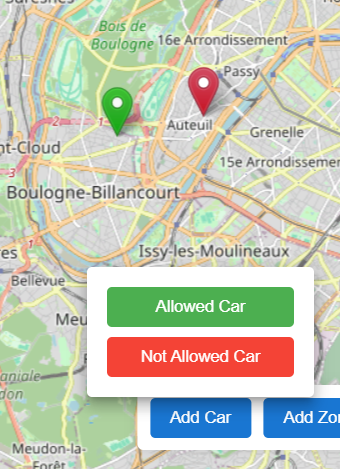

# Zero Emission Zone Management System

A React-based web application for managing zero emission zones in urban areas, allowing users to define restricted zones, manage vehicles, and plan routes that respect emission restrictions.

## Features

### 1. Interactive Map Management
- Add and edit circular or polygon-shaped restricted zones
- Real-time zone editing with vertex manipulation
- Visual feedback for restricted areas
 <!-- Screenshot of creating a zone with editing controls visible -->
 <!-- Screenshot showing vertex editing, resizing of a zone -->

### 2. Vehicle Management
- Add and position vehicles on the map
- Two types of vehicles: allowed (green) and not-allowed (red)
- Visual distinction between vehicle types
 <!-- Screenshot showing different types of vehicles on map -->

### 3. Parking Lot Management
- Place parking lots strategically around restricted zones
- Used for route planning with restricted vehicles
 <!-- Screenshot showing parking lots and their placement -->

### 4. Smart Routing System
- Intelligent route calculation based on vehicle type
- For allowed vehicles:
  - Direct routes through all zones
- For restricted vehicles:
  - Routes avoiding restricted zones
  - Automatic parking lot suggestions
  - Alternative routes through parking lots when necessary
 <!-- Screenshot of allowed car with direct route -->
 <!-- Screenshot of restricted car with alternative route through parking -->

### 5. Edit Mode
- Comprehensive editing capabilities
- Move and adjust all map elements
- Modify zone shapes and sizes
 <!-- Screenshot showing edit mode interface -->

## Technical Features

- Built with React and TypeScript
- Uses React-Leaflet for map functionality
- OpenRouteService integration for real-world routing
- Geometric algorithms for:
  - Point-in-polygon detection
  - Line-zone intersection
  - Optimal parking lot selection
- Modular component architecture
- Real-time updates and interactions

## Getting Started

1. Clone the repository
```bash
git clone https://github.com/yusuferdem16/zero_emission.git
cd zero_emission
```

2. Install dependencies
```bash
npm install
```

3. Add your OpenRouteService API key in `src/config.ts`
```typescript
export const ORS_API_KEY = 'your-api-key-here';
```

4. Start the development server
```bash
npm run dev
```

## Usage Guide

1. **Adding Zones**:
   - Click "Add Zone"
   - Choose circle or polygon
   - Click on map to create
   - For polygons, click multiple points to create shape

2. **Managing Vehicles**:
   - Click "Add Car"
   - Choose allowed or not-allowed type
   - Click on map to place

3. **Adding Parking Lots**:
   - Click "Add Parking Lot"
   - Click on map to place

4. **Getting Directions**:
   - Select a vehicle
   - Click "Get Directions"
   - Click destination on map
   - View suggested route

5. **Editing Elements**:
   - Click "Edit"
   - Select element to modify
   - Use controls to adjust

## Screenshots Needed

1. `zone-creation.png`: Show the process of creating a zone (with the control panel visible)
2. `zone-editing.png`: Display zone editing with vertex handles and resize controls
3. `vehicle-management.png`: Show both allowed (green) and not-allowed (red) vehicles on the map
4. `parking-management.png`: Show parking lots placed around restricted zones
5. `allowed-routing.png`: Show a direct route for an allowed vehicle
6. `restricted-routing.png`: Show a route for a restricted vehicle with parking lot detour
7. `edit-mode.png`: Show the edit mode interface with controls

Please provide these screenshots and I'll update the README with the actual images.
